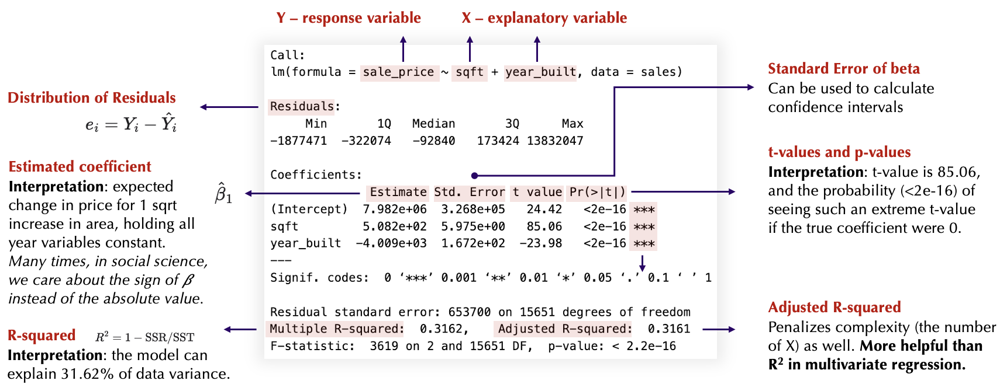
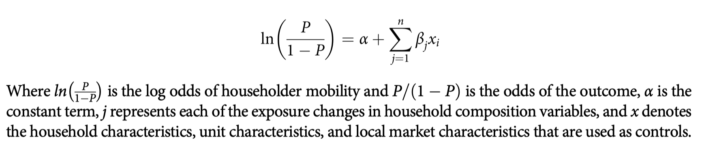
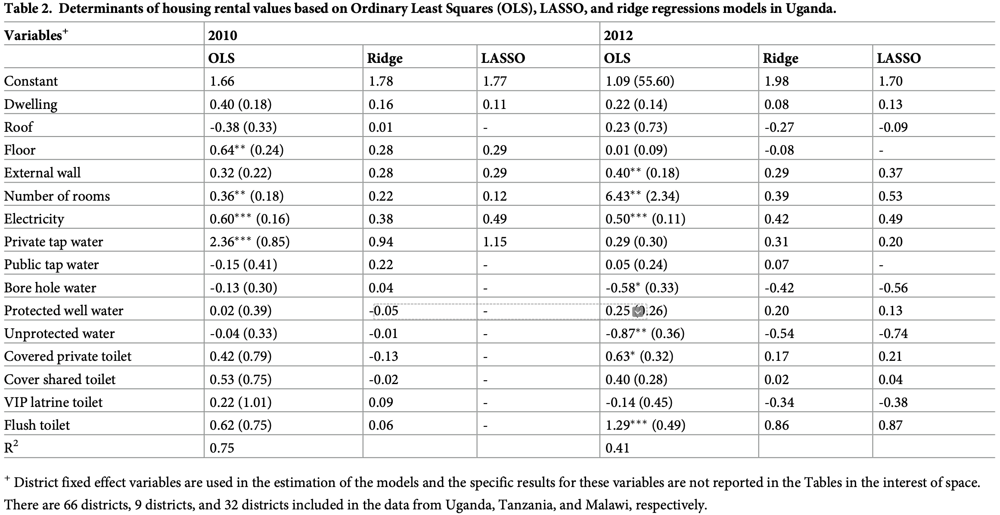
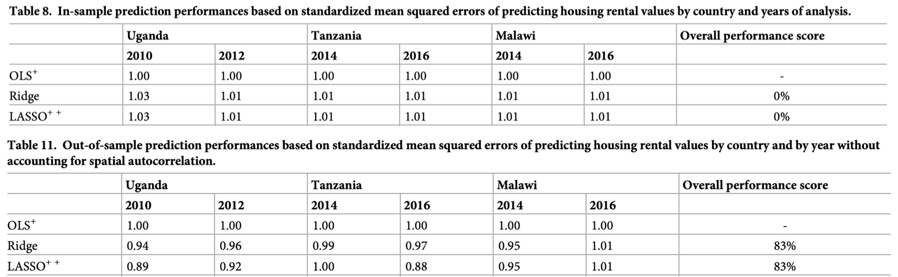

```{r setup, include=FALSE}
knitr::opts_chunk$set(echo = TRUE)
```

------------------------------------------------------------------------

<!-- start of the main lab content -->

In Lab 7, we will go back to the **King County sales** data from
maintained by [Andy Krause](https://www.andykrause.com/index.html) at
Zillow. You can find the datasets and Readme file in [this
repository](https://github.com/andykrause/kingCoData).

In Part A, we will use classical regression, which considers more on the
model specification, assumptions, and parameter interpretation. In Part
B, we will still use regression but under the context of machine
learning. We care about the prediction accuracy on unseen test dataset.
A seminal paper discusses the **two cultures in statistical modeling**:
[Statistical Modeling: The Two Cultures. Leo Breiman.
2001.](https://projecteuclid.org/journals/statistical-science/volume-16/issue-3/Statistical-Modeling--The-Two-Cultures-with-comments-and-a/10.1214/ss/1009213726.full)

The due day for each lab can be found on the [course
wesbite](https://www.yuehaoyu.com/data-analytics-visualization/). The
submission should include Rmd, html, and any other files required to
rerun the codes.

From Lab 4, the use of any generative AI tool (ChatGPT, Copilot, etc.)
is **allowed** for coding assignments. But, I still encourage you to
write codes by yourself and use AI tools as a way to debug and explore
new knowledge. More information about [Academic
Integrity](https://www.yuehaoyu.com/data-analytics-visualization/syllabus/#academic-integrity)
and [the Use of
AI](https://www.yuehaoyu.com/data-analytics-visualization/syllabus/#use-of-ai).

------------------------------------------------------------------------

## Lab 07-A: Regression in Statistics

```{r message=FALSE}
#install.packages("modelsummary") # you only need to run the installation once
#install.packages("devtools") # if you are using a Windows computer
#devtools::install_github('andykrause/kingCoData') # you only need to run the installation once
library('tidyverse')
library(modelsummary) # the package for formatting the regression result table
library('kingCoData') # load the data package
```

```{r}
data(kingco_sales) # load the sale data
# only select the sales in 2023
sales <- kingco_sales %>% 
  filter(sale_date >= as.Date("2023-01-01") & sale_date <= as.Date("2023-12-31"))
```

### A Simple Linear Regression

#### Checking Correlation

Correlation ($r$) measures the strength and direction of a linear
relationship between two variables. The most common one for continuous
numeric data is [**Pearson
correlation**](https://en.wikipedia.org/wiki/Pearson_correlation_coefficient),
which ranges from -1 to 1.

-   +1 Perfect positive correlation
-   0 No linear relationship
-   –1 Perfect negative correlation

Note: Correlation is a useful starting point for selecting variables. We
often use $|r| > 0.3$ as a rough criterion for inclusion. But we still
need to incorporate domain knowledge and some diagnostic testing. For
example, correlation between sale price and year built is only \~0.1,
which suggests a weak linear relationship, but it may still be
theoretically relevant.

```{r}
cor(sales[, c("sale_price", "sqft", "year_built", "condition")])
```

#### Scatterplots

```{r}
sales_long <- sales |>
  pivot_longer(
    cols = c(sqft, year_built),
    names_to = "variable",
    values_to = "xvalue"
  )

ggplot(sales_long, aes(x = xvalue, y = sale_price)) +
  geom_point(size = 0.3, alpha = 0.5, color = "#e8e3d3") +
  geom_smooth(linewidth = 0.5, method = "lm", formula = "y~x", color = "#4b2e83") +
  facet_wrap(~ variable, scales = "free_x") +
  labs(
    x = "Explanatory Variable",
    y = "Sale Price ($)",
    title = "Sale Price vs. Square Footage of House (Sqft) and Year Built"
  ) +
  theme_minimal()
```

#### Fitting the Model

Starting to fit a regression, you define a family of models that express
a precise, but generic, pattern that you want to capture. For example,
the pattern might be a straight line, or a quadratic curve. You will
express the model family as an equation like $y = \beta_0 + \beta_1 x$
or $y = \beta_0 + \beta_1 x^2$. Here, $x$ and $y$ are known variables
from your data, and $\beta_0$ and $\beta_1$ are parameters that can vary
to capture different patterns.

```{r}
# lm means linear model
# we don't need to add intercept, R will add it for us
simple_lm <- lm(data = sales, sale_price ~ sqft + year_built)
```

We can check the results using `summary()` (result table) and
`confint()` (confidence intervals).

```{r}
summary(simple_lm)
confint(simple_lm)
```

How to read the tables?



<details>

<summary><b>Click to view additional notes on reading the
results</b></summary>

**Hypothesis**: The model test if $Y$ is associated with $X$. The null
hypothesis $H_0$ is that there is no linear relationship between the
response variable and the explanatory variable(s), and the alternative
hypothesis $H_1$ is that there is relationship.

**Estimate and standard error**:In the model, estimate is the estimation
of coefficient $\beta$, std.error is the standard error for estimation.
The standard error of the coefficient is an estimate of the standard
deviation of the coefficient $\beta$. In effect, it is telling us how
much uncertainty there is with our coefficient. The standard error is
often used to create confidence intervals.

**t-statistic**: The t-statistic is simply the coefficient divided by
the standard error. In general, we want our coefficients to have large
t-statistics, because it indicates that our standard error is small in
comparison to our coefficient. Simply put, we are saying that the
coefficient is $t$ standard errors away from zero.

**p-value**: If you see the variable has p value $\leq 0.05$, or you can
also see the star next to $Pr(>|t|))$, we can say we reject the null
hypothesis. In practice, any p-value below 0.05 is usually deemed as
significant. What do we mean when we say significant? It means we are
confident that the coefficient is not zero, meaning the coefficient does
in fact add value to the model by helping to explain the variance within
our dependent variable. **Note:** reading the stars this way only works
for individual variables and not categorical variables.

**R-squared**: R-squared explains how much variation of y can be
explained by the model. This is helpful for univariate regression, but
starts to become fairly unhelpful for multivariate regression. We would
look at adjusted R-squared, which penalizes complexity.

</details>

### Check Assumptions

For a normal linear model to be a good model, there are some
conditions/assumptions that need to be fulfilled.

-   **Linearity**: $Y$ changes linearly with $X$. $Y$ can be described
    by a linear combination of $X$ (or transformation of $X$).
-   **Independence**: the residuals are independent of each other. We
    are using time series and spatial data so we are likely violate this
    assumption.
-   **Normality and homoscedasticity for error terms**: the distribution
    of the residuals is normal with equal variance.
-   **No perfect multicollinearity among X**: X should not be a linear
    combination of each other. Example: using all three scores as $X$ if
    total score = part A score + part B score.

If these assumptions are not met, the inference with the computed
standard error is invalid. That is, if the assumptions are not met, the
standard error should not be trusted, or should be computed using
alternative methods.

The quickest way to check many assumptions is to use `plot(model)` and
it will generated several key plots for us. We use `which` to specify
the plot but in practice, you can generate them at the same time.

We will setup a 'perfect' model as the example to compare:

```{r}
example_x <- seq(1, 100, by = 1)
example_y <- 3 + 2 * example_x + rnorm(100, mean = 0, sd = 2)
example_model <- lm(example_y ~ example_x)
```

#### Residuals vs Fitted

```{r}
plot(example_model, which = 1, title("Perfect Model"))
plot(simple_lm, which = 1, title("Our Linear Model"))
```

**Horizontal Axis**: Fitted values (predicted values) from the
regression model.

**Vertical Axis**: Residuals (the differences between the observed
values and the predicted values).

**Interpretation**: This plot helps you check for linearity and
homoscedasticity (equal variance of error terms). Ideally, you should
see a horizontal red line (for linearity) and random scatter of points
with no discernible pattern (for homoscedasticity). If there’s a pattern
(e.g., a curve or fan shape), it suggests non-linearity or
heteroscedasticity, which might indicate a problem with the model.

**In our case**: no much concern on the linearity (red line is around
0); some level of heteroscedasticity (fan shape - residuals variance
increase with the increase of fitted values). That happens a lots in
price data, which is often right-skewed/long-tailed and log
transformation to $Y$ is a common strategy.

#### Q–Q Plot

[Q-Q
plots](https://library.virginia.edu/data/articles/understanding-q-q-plots)
helps us to compare a set of data with normal distribution. If the data
is perfectly normally distributed, it should follow the dash line. In
our case, we can see the residuals are not normally distributed. It
reconfirms the price data is right-skewed/long-tailed.

-   S-shaped curve: heavier tails or more peaked than the normal
    distribution (for example, a t-distribution).
-   Curved upward or downward: skewness (the data are not symmetric).
-   Clearly deviating from the straight line: Suggests the data are not
    normally distributed.

```{r}
plot(example_model, which = 2, title("Perfect Model"))
plot(simple_lm, which = 2, title("Our Linear Model"))
```

#### Residuals vs Leverage

```{r}
plot(example_model, which = 5, title("Perfect Model"))
plot(simple_lm, which = 5, title("Our Linear Model"))
```

**Horizontal Axis**: Leverage values, which indicate how much the
corresponding observation influences the fit.

**Vertical Axis**: Standardized residuals (residuals divided by their
standard deviation).

**Interpretation**: This plot helps you identify *influential data
points (outliers)* and *influential cases (observations with high
leverage)*. Points that are far from the horizontal line at zero
indicate observations with high standardized residuals. Points that are
far from the vertical line at 1/n (where n is the number of
observations) have high leverage. The gray dash line is the Cook’s
Distance; points above the line have will have noticeable change to
regression line if removed.

**In our case**: There are a few outliers (5452, 13765, 11635) but it is
not a super serious problem (within Cook's distance = 0.5). We can check
whether the original data is correctly collected. After that, we can
decide whether to remove them.

#### Multicollinearity

The Variance Inflation Factor (VIF) measures how much the variance of a
regression coefficient is inflated due to collinearity with other
predictors. If there is perfect multicollinearity, R will automatically
drop one of the variables. If there is imperfect multicollinearity. R
won’t drop and the model estimates will be biased.

-   VIF = 1: no correlation with other predictors.
-   VIF \> 5: moderate multicollinearity concern, potential for removal.
-   VIF \> 10: serious multicollinearity, must remove the variable

```{r message=FALSE}
#install.packages('car')
library(car)
vif(simple_lm)
```

### Adjustment to the Regression

Because the original model showed heteroscedasticity (the “fan shape”
pattern in residual plots), we apply a log transformation to the $Y$
`sale_price`. Almost everything is better after the transformation.

```{r}
log_simple_lm <- lm(data = sales, log(sale_price) ~ sqft + year_built)
plot(log_simple_lm)
```

```{r}
summary(log_simple_lm)
```

You may notice that the $\beta$ in log-transformed model is quite small.
Because of the transformation, our interpretation of $\beta$ could be
different! Holding other variables constant, we change $X_1$ for one
unit, we can write as:

$$
\begin{aligned}
\log(Y_{changed}) & = \beta_0 + \beta_1 (X_1 + 1) + \beta_2 X_2 + \varepsilon \\
                  & = \beta_0 + \beta_1 X_1  + \beta_2 X_2 + \varepsilon + \beta_1 \\
                  & = \log(Y_{original}) + \beta_1\\
\beta_1 & = \log(Y_{changed}) - \log(Y_{original}) \\
        & = \log(\frac{Y_{changed}}{Y_{original}}) \\
\exp(\beta_1) & = \frac{Y_{changed}}{Y_{original}}
\end{aligned}
$$

We use `coef()` to get accurate $\beta$:

```{r}
coef(log_simple_lm)
```

```{r}
exp(0.0003717023)
```

So, we can explain the relationship between sale price and square
footage of house as: holding all year variables constant, the expected
**percentage change** in price for 1 sqft increase is 0.3%.

Note: if we want to know expected percentage change in price for 100
sqft, it should be $1.000372^{100}$ (+3.79%) instead of
$0.000372 \times 100$ (+3.72%).

### Interactions and Non-linear Variables

An interaction means that the **effect** of one variable depends on the
level of another variable. For example, we may think of the effect of
house size on price changes depending on the house’s condition. We can
add interaction terms by using `*`. Note: R will add `condition` itself
as an explanatory variable in the following model:

```{r}
log_no_interaction_lm <- lm(data = sales, log(sale_price) ~ year_built + sqft + condition)
log_interaction_lm <- lm(data = sales, log(sale_price) ~ year_built + sqft + sqft * condition)
```

You could also have variables in you specification that are squared,
cubed etc. such as:

```         
model7 <- lm(sale_price ~  sqft + I(sqft^2) + cos(sqft), data = sales)
```

The `I()` is a base R command that forces R to evaluate anything inside
the `I()` before anything else. Sometimes it is needed when conducting
regressions.

### Compare Models

When compare with several models, we can use `modelsummary` package to
display and compare regression results in one formatted table. It helps
us quickly see how coefficients, significance levels, and model fit
change.

```{r}
modelsummary(
  list(
    "Without Interaction Model" = log_no_interaction_lm,
    "Interaction Model" = log_interaction_lm
  ),
  stars = TRUE,
  fmt = 5, 
  title = 'Comparsion Table between Models with/without Interaction',
  output = "html")
```

In an interaction model, the $\beta$ of individual variables (those also
appearing in the interaction term) represent their effects only when the
other interacting variable equals zero. So, it is a **baseline effect**
and does not have much direct meanings. We must always interpret them
together with the interaction term. In our interaction model:

-   0.00026: effect of sqft when condition = 0 (condition cannot be 0 in
    the data)
-   -0.06512: effect of condition when sqft = 0 (square footage of house
    is not likely to be 0)

For the interaction term, we can explain as: with a one-unit increase in
condition, holding other variables constant, the coefficient (slope) of
sqft increases by 0.0003.

We see a significant positive interaction: the positive effect of square
footage on price is stronger for houses in better condition. In other
words, larger houses benefit more from good condition than smaller ones.

#### Performance Metrics

**R-squared and Adjusted R-squared [larger - better]**: Mentioned in the
lecture, R-squared shows how much of the variation in the response
variable is explained by the model. Adjusted R-squared corrects for the
number of predictors, so it is better for comparing models with
different numbers of variables.

**Root Mean Squared Error (RMSE) [smaller - better]**: Root of MSE,
measures the average distance between the observed and predicted values.
Smaller RMSE means better model fit.

**Akaike’s Information Criterion (AIC) [smaller - better]**: AIC is good
for unknown data generating process(The AIC tries to select the model
that most adequately describes an unknown, high dimensional reality.
Akaike’s Information Criteria is good for making asymptotically
equivalent to cross-validation. You can check AIC using `AIC(model)`.

**Bayesian Information Criterion (BIC) [smaller - better]**: BIC tries
to find the TRUE model among the set of candidates. A lot of times, BIC
and AIC will agrees on each other, but BIC penalize models that have a
lot of parameters. Danger of underfit. Bayesian Information Criteria is
good for consistent estimation. You can check BIC using `BIC(model)`.

In general, our interaction model perform better in terms of all four
metrics. And we will use this model to conduct prediction. Note: we may
still need same assumption check for the new model.

### Prediction

We can use `predict` function to generate predicted values from a
regression model.

```{r}
# we add a new column in sales dataframe
sales$predicted <- predict(log_interaction_lm, data = sales)
# check the prediction
sales$predicted[1]
```

Check the prediction, we find the value is extremely small (13.57 \<\<
real sale price). We used log transformation to response variable! We
need to transform the predicted values back by taking the exponential
(exp) of each prediction to return them to the original sale price
scale.

```{r}
sales$predicted_exp <- exp(sales$predicted)
sales$predicted_exp[1]
```

### 📚 TODO: Explain the Results of Logistic Regression

**10 points**

**You may discuss in small group, but you must prepare the submission by
yourself. Generative AI is NOT allowed for write-up questions. You ask
conceptual questions but you need to cite properly. [How to
cite?](https://www.yuehaoyu.com/data-analytics-visualization/syllabus/#use-of-ai)**

**Your submission should be HTML or PDF. Handwritten PDFs are acceptable
as long as they are scanned and easy to read. Part B will not require
any coding as well.**

In this section, we will read a recent research paper published by
Runstad Department faculty Rebecca J. Walter, Arthur Acolin, Ruoniu
(Vince) Wang, Gregg Colburn, along with people from other institutions:
[**Exploring the association between household compositional change and
mobility of subsidized householders in the United
States**](https://doi.org/10.1080/07352166.2024.2371380). You are able
to find the PDF version within the lab folder.

This study examines the relationship between household compositional
change (such as a partner, child, or adult entering or leaving the
household) and residential mobility of subsidized householders in the
US. They use the Annual Longitudinal Files 2005–2018 from U.S.
Department of Housing and Urban Development, which is restricted-use
data required researchers to apply to access. [Northwest Federal
Statistical Research Data
Center](https://csde.washington.edu/services/northwest-federal-statistical-research-data-center/)
is the center within UW partnered with U.S. Census Bureau to provide
such data access.

Please skim the paper first and use the following to guide your further
reading, especially about the **Data and methods** and **Results**
parts.

#### Settings

1.  [1 pt] What is the unit of analysis of this study? What is the
    sample size $N$? Is this study cross-sectional or longitudinal
    (lecture 2 data)?
2.  [0.5 pt] Why do you think U.S. Census Bureau requires us apply for
    the data usage instead of providing public access like American
    Community Survey (ACS) data?
3.  [0.5 pt] In a research paper, we tend to include two parts of
    explanatory variables: (1) the **key explanatory variables (or
    variables of interest)**, which directly address the research
    question; and (2) the **control variables**, which account for other
    factors that might also influence the response variable. In this
    paper, what are the key explanatory variables and response variable?
4.  [1 pt] What is the purpose of including local market characteristics
    as part of $X$? Even though we do not have access to the data, which
    variables could be multicollinear with local market characteristics?
5.  [0.5 pt] Can we use normal linear regression for this study?
6.  [0.5 pt] The follow picture shows model specification in page 8 of
    this paper. Do you find any problem with this equation and
    explanation, especially for the explanatory variable part?



#### Model Configurations and Results

This study use logistic regression, which is similar to linear
regression but for binary response variable (1/0). We change $Y$ with
$\log(P/(1-P))$, where $P$ is the probability of $Y=1$. [This post from
IBM would be helpful to understand logistic
regression.](https://www.ibm.com/think/topics/logistic-regression) Think
about this model:

$$
\log(\frac{P}{1-P}) = \beta_0 + \beta_1 X_1 + \beta_2 X_2
$$

1.  [1 pt] How should we interpret $\beta_1$?
2.  [0.5 pt] In the result tables of this paper, they use **Odds Ratio**
    rather than the coefficient of $X$. How could you calculate the
    coefficient $\beta$ for Household Member Enters or Exits (with odd
    ratio of 1.671)? The table below shows part of the results.
3.  [0.5 pt] How much more likely are households with a compositional
    change (a member entering or exiting) to move, compared to those
    without, controlling for other factors?
4.  [1 pt] What are the null and alternative hypotheses being tested by
    the t-value (398.7) for “Household Member Enters or Exits” in Model
    1? What is the meaning of '\*\*\*'?
5.  [1 pt] They conducted at least three logistic regression models. Why
    did they do that?
6.  [1 pt] The authors only use tables to present results. What is one
    way to visualize the adds ratio from this logistic model to show
    uncertainty of the results? You can use a plot example to
    illustrate.
7.  [1 pt] The title of this paper uses *association* rather than
    *effect*, *impact*, or *influence*. Authors are also very cautious
    term usages in main text. What is the reason?


---

## Lab 07-B: Regression in Machine Learning 

We will use [`tidymodels`](https://www.tidymodels.org), which is a R package for modeling and machine learning in R using tidyverse principles. It provides us a framework. It is helpful to know that machine learning and deep learning are normally run with Python. For the consistence of this class, we will continue use R. But it is not difficult to transfer to Python! Some resources: 

- [An Introduction to Python for R Users](https://rebeccabarter.com/blog/2023-09-11-from_r_to_python)
- [Conversion R and Python](https://www.mit.edu/~amidi/teaching/data-science-tools/conversion-guide/r-python-data-manipulation/)

```{r message=FALSE}
#install.packages("tidymodels") # you only need to install once
library(tidymodels)    
```

We will use the same dataset as section A but let's forget the most assumptions (normality, linearity, etc.) and focus purely on predictive performance! We will train and evaluate linear regression, ridge regression, and lasso regression using cross-validation to see which approach yields the best testing predictions.

### Data Preparation 

There are too many variables can be added to the model. Some are not suitable for a prediction task, such as longitude and latitude. We start from remove some data columns and merge some of them. After that, do some cleaning based on inspection. 

In a more rigorous machine learning process, we may conduct feature engineering and selection before training. For example, we could use [Principal Component Analysis (PCA)](https://en.wikipedia.org/wiki/Principal_component_analysis) to reduce dimension or select most important features based on correlation results. A more comprehensive book on this: [Feature Engineering and Selection: A Practical Approach for Predictive Models](http://www.feat.engineering).

```{r}
sales_pred <- sales %>%
  mutate(view_mountains = view_rainier + view_olympics + view_cascades + view_territorial,
         view_water = view_sound + view_lakewash + view_lakesamm + view_otherwater)
# select some features (subjective here)
sales_pred <- sales_pred %>%
  dplyr::select(sale_price, year_built, sqft_lot, sqft, beds, view_skyline, view_mountains, view_water) 
```

Before train the model, we need to split the dataset into a training set and a testing set. The training data will be used to train the models, while the testing data will be reserved to evaluate how well the model generalizes to unseen observations.

```{r}
set.seed(123)
split <- initial_split(sales_pred, prop = 0.8) # 80% training data
train_data <- training(split)
test_data  <- testing(split)
```

We are going to build a recipe for data preprocessing. A recipe is the steps to do data preparation under `tidymodels` framework. For Lasso and ridge, we need to normalize features.

```{r}
rec <- recipe(sale_price ~ ., data = train_data) %>% # model and dataset
  step_poly(year_built, degree = 5) %>% # add polynomial expansion to x, x^2, x^3, x^4, x^5
  step_poly(sqft, degree = 5) %>% 
  step_poly(sqft_lot, degree = 5) %>%
  step_poly(beds, degree = 5) %>%
  step_zv(all_numeric()) %>% # remove variables that contain only a single value
  step_normalize(all_predictors()) # normalize (center and scale) the numeric variables
```

Please note that The object `rec` is a recipe that has **not been trained** on data yet (for example, does not normalize).

### Model Specification 

We start from specify the lasso regression. In `tidymodels`, the model type (`linear_reg`) and the computational engine (`glmnet`) are separated.

```{r}
lasso_spec <- linear_reg(
  penalty = tune(), # penalty hyperparameter: tuneable and selected by cross-validation
  mixture = 1 
  # mixture = 1 is lasso and mixture = 0 is ridge
  # mixture in (0,1) is elastic net (combination of lasso and ridge)
) %>% 
  set_engine("glmnet") # specify which package or system will be used to fit the model
  # `glmnet` is the engine that implements penalized linear models.
```

A workflow is a container that bundles together a recipe (data preprocessing steps) and a model specification.

```{r}
# use `workflow()` to put receipt and models together. We have not train yet!
lasso_workflow <- workflow() %>%
  add_recipe(rec) %>%
  add_model(lasso_spec)
```

### Tuning Grid for Penalty

We can define the search space for $\lambda$. `penalty(range = c(a, b))` specifies the log10 scale from $10^a$ - $10^b$. 

```{r}
lambda_grid <- grid_regular(
  penalty(range = c(2, 5)), # 100 - 10000; determined by yourself after attempts
  levels = 50 # try 50 values between the previous range
)
```

### Cross-validation Setup

We make 5 folds to separate the `train_data` into five equally sized subsets for cross-validation.

```{r}
folds <- vfold_cv(train_data, v = 5)
```

### Model Training via Grid Search

```{r}
tune_results <- tune_grid(
  lasso_workflow,
  resamples = folds,
  grid = lambda_grid, 
  metrics = metric_set(rmse, rsq) # we evaluate two metrics: RMSE (error) and R² (fit)
)
```

### Cross-validation Results

We show the model performance changes as $\lambda$ increases via a curve. 

```{r}
autoplot(tune_results)+
  theme_minimal(base_family = "opensans", base_size = 12) +            
  labs(title = "Lasso Regression Cross-validation Curve",
       x = "Penalty/lambda (log10 scale)")
```

### Fit the Final Model using the Best $\lambda$

```{r}
best_lasso <- select_best(tune_results, metric = "rmse")

# another workflow
final_lasso <- workflow() %>%
  add_model(finalize_model(lasso_spec, best_lasso)) %>% # finalize_model() inserts the chosen lambda into the model specification
  add_recipe(rec) %>% # the same recipe
  fit(train_data) # train the final Lasso model using the full training set
```

We can check the final coefficients using `tidy(workflow)`. variables with estimate = 0 have been removed by lasso regression.

```{r message=FALSE}
tidy(final_lasso) %>% filter(estimate != 0)
```

#### Testing 

We evaluate the performance of the final Lasso model on the held-out test set. The `predict()` function generates predicted sale prices for the test data, and `metrics()` computes evaluation measures such as RMSE and R².

```{r}
pred_lasso <- predict(final_lasso, test_data) %>%
  bind_cols(test_data)
metrics(pred_lasso, truth = sale_price, estimate = .pred)
```

### 📚 TODO: Review the Code for Regression

**2 points**

Carefully review and run all code chunks. You are encouraged to modify the model and explore ridge regression. Reply “yes” once you have reviewed them.

### 📚 TODO: Machine Learning to Predict the Rental Value

**4 points**

In this section, we will read a recent research paper that applies several machine learning regression techniques—including Lasso, Ridge, and tree-based models—to predict housing rental values in three African countries. The paper, [Predicting the rental value of houses using hedonic and machine learning regression models](https://doi.org/10.1371/journal.pone.0244953) examines how different modeling approaches perform when estimating rental values based on a wide range of housing characteristics, infrastructure indicators, and household attributes.
You can find the PDF version of the article in the lab folder. Please skim the paper first and response to following questions. You can skip the parts beyond regression. 

1. [1 pt] Why do we need regularization in Lasso and Ridge regression? What effect does regularization have on variance and bias, respectively? 
2. [1 pt] In the model, the variable “roof” equals 1 if the house has a mud roof and 0 otherwise. If the Lasso regression sets the coefficient of this variable to zero in 2010, can we conclude that roof type is not associated with rental value? Why or why not?
3. [1 pt] Why do the authors use cross-validation in their analysis? And how cross-validation is used to choose the regularization parameter ($\lambda$) in Lasso and Ridge regression?
4. [1 pt] In the prediction performance table, OLS performs best in the in-sample evaluation, while Lasso and Ridge outperform OLS in the out-of-sample evaluation. Could you guess the reason for this pattern?

 

 

## Acknowledgement

The materials are developed by [Haoyu Yue](www.yuehaoyu.com) based
materials from [Dr. Feiyang Sun at UC San Diego](https://fsun.ucsd.edu),
Siman Ning and Christian Phillips at University of Washington, [Dr.
Charles Lanfear at University of Cambridge](https://clanfear.github.io).
